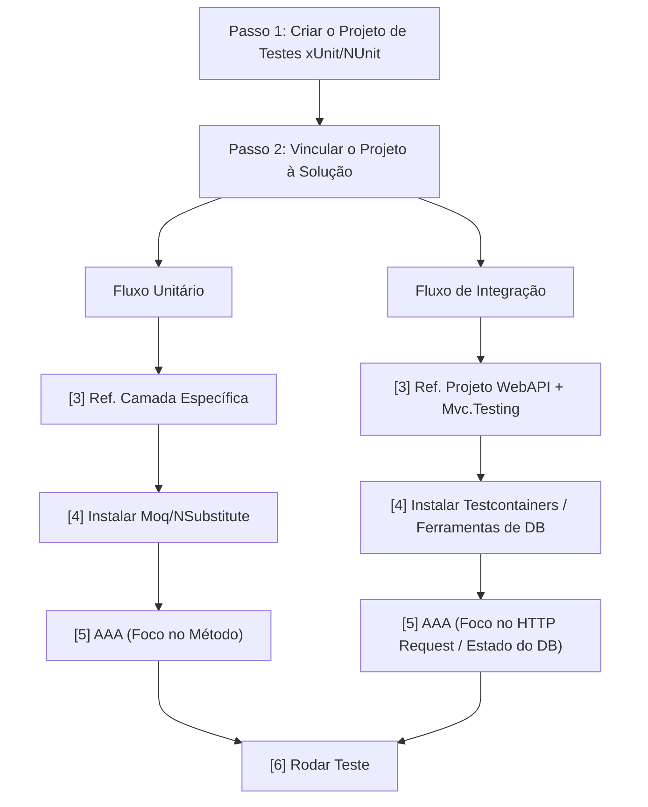

# Entendendo CI/CD: Integração e Entrega Contínua

**CI/CD** significa **Continuous Integration** (Integração Contínua) e **Continuous Delivery** ou **Continuous Deployment** (Entrega ou Implantação Contínua).

Na prática, é uma metodologia apoiada por automação que transforma o ciclo de desenvolvimento de software, garantindo que o código saia da máquina do desenvolvedor e chegue até o ambiente de produção de forma rápida, segura e padronizada.

Imagine o CI/CD como uma esteira de produção automatizada: o código entra em uma ponta, passa por testes, validações e empacotamento, e sai na outra ponta pronto para o usuário final, sem depender de processos manuais lentos e propensos a falhas humanas.
> Os conceitos explicados a seguir foram implementados e validados em um projeto real desenvolvido em **.NET** [[Link do Projeto](https://www.google.com/search?q=projeto-link)].

## 1. CI — Continuous Integration (Integração Contínua)

O foco central do CI é a **frequência de integração** e a **validação automatizada**. Em vez de os desenvolvedores trabalharem isolados por semanas, o que resulta em conflitos de merges (_Merge Hell_), as alterações são integradas ao repositório central múltiplas vezes ao dia.

Esse processo remove o fator humano da validação. Sempre que um desenvolvedor realiza um `git push` ou abre um `Pull Request`, uma esteira de automação (servidor de CI) é acionada e executa rigorosamente as seguintes etapas:

-   **1. Provisionamento e Checkout:** A esteira aloca uma máquina virtual limpa e executa o _Checkout_ (baixa o código do seu repositório para dentro dessa máquina).    
-   **2. Configuração do Ambiente:** Instala o **.NET SDK** na versão exata especificada no projeto. Sem isso, a máquina não possui os compiladores e ferramentas necessárias.    
-   **3. Restore (Restauração):** O comando `dotnet restore` é executado. O ambiente baixa todos os pacotes e dependências externas (como os pacotes NuGet) necessários para o projeto rodar.    
-   **4. Build (Compilação):** O sistema compila o código-fonte (`dotnet build`). Essa etapa garante de forma automatizada que não existem erros de sintaxe, referências perdidas ou quebras de contrato no código.    
-   **5. Execução dos Testes Unitários:** O motor de testes roda a suíte de testes unitários. É a validação rápida de algoritmos, regras de negócio e lógica isolada de métodos.    
-   **6. Execução dos Testes de Integração:** Roda a suíte de testes de integração, validando o comportamento de ponta a ponta, comunicação com banco de dados, requisições HTTP e controllers da API.
        
`foto do github https://github.com/najumattos/vitrine-semi-joias/actions/runs/26670856452/job/78613656736`

`exemplo ERRO`
`exemplo Sucesso`

> ⚠️ **Regra de Ouro do CI:** A esteira funciona como um portão de qualidade. Se qualquer teste falhar ou a compilação quebrar, o processo é abortado imediatamente, o código é bloqueado e a equipe é alertada. O código defeituoso jamais avança para as próximas etapas (CD).

### 1. Testes Unitários (Unit Tests)
O foco do teste unitário é testar a **menor unidade isolada de código** possível. Geralmente, essa unidade é um método ou uma função específica de uma classe.
A regra principal aqui é o **isolamento absoluto**: o teste unitário não pode conversar com o banco de dados, não pode fazer chamadas de rede (APIs externas) e não pode depender do sistema de arquivos. Qualquer dependência externa é substituída por um objeto simulado (chamado de **Mock** ou **Stub**).
-   **Analogia do carro:** É você tirar uma vela de ignição do motor, colocá-la em uma bancada de testes isolada e verificar se ela solta faísca quando recebe corrente elétrica. Você não quer saber se o motor liga; quer saber se _aquela peça específica_ funciona sozinha.

 `exemplo ProductServiceTest`         
 
**Vantagens:**
-   **Velocidade:** Como rodam totalmente em memória e sem comunicação externa, milhares de testes unitários podem ser executados em pouquíssimos segundos.    
-   **Precisão do erro:** Se o teste falhar, você sabe exatamente qual linha de código e qual regra de negócio quebrou.


### 2. Testes de Integração (Integration Tests)

O foco do teste de integração é validar se **duas ou mais unidades/componentes funcionam bem juntos**. Ele preenche a lacuna que o teste unitário deixa ao isolar tudo.
Aqui, os pontos de atrito são testados: a comunicação entre o código e o banco de dados real, a integração com uma API de pagamento, ou se duas classes de regras de negócio distintas conversam corretamente sem corromper os dados.
-   **Analogia do carro:** É o momento de montar a vela no motor, conectar o tanque de combustível, girar a chave e ver se o motor dá a partida. As peças individuais podem estar perfeitas, mas se o cabo de combustível estiver entupido (falha na integração), o motor não vai funcionar.
    
 `exemplo AuthServiceTest`    

**Vantagens:**

-   **Confiança Real:** Ele garante que as partes do sistema realmente se conectam e que as queries do banco de dados estão corretas.    
-   **Pega falhas ocultas:** Descobre erros de configuração, problemas de permissão de acesso a dados ou incompatibilidade de contratos entre sistemas.


## Comparativo
| Caracteristica | Testes Unitários | Testes de Integração |
|--|--|--|
| Escopo | Uma única função, método ou classe | Fluxo entre múltiplos componentes/sistemas
| Velocidade | Extremamente rápidos (milissegundos) | Mais lentos (dependem de I/O, rede, banco) |
| Dependências | Nenhuma (usa Mocks/Simulações) | Reais (Banco de dados, arquivos, APIs)|

## Como criar um projeto de testes em c#?


`adicionar uma foto da estrutura de pastas do meu projeto`

### Fluxo de Testes Unitários
* **Passo 1:** `dotnet new xunit -o tests/MeuProjeto.Tests.Unit`
* **Passo 2:** `dotnet sln MeuProjeto.sln add tests/MeuProjeto.Tests.Unit/MeuProjeto.Tests.Unit.csproj`

* **Passo 3:** ` dotnet add tests/MeuProjeto.Tests.Unit/MeuProjeto.Tests.Unit.csproj reference src/MeuProjeto.API/MeuProjeto.API.csproj` 

* **Passo 4:** 
	```bash
	cd tests/MeuProjeto.Tests.Unit
	dotnet add package NSubstitute
	```
	
* **Passo 5: Escrever o Primeiro Teste (Padrão AAA):** Crie uma classe de teste. Toda estrutura de teste unitário deve seguir o padrão **AAA (Arrange, Act, Assert)**:
	-   **Arrange (Organizar):** Prepara o cenário, cria instâncias e simula os mocks.    
	-   **Act (Agir):** Executa o método específico que você quer testar.    
	-   **Assert (Verificar):** Garante que o resultado obtido é igual ao resultado esperado.
`add exemplo da vitrine`
* **Passo 6**: `dotnet test` 

### Fluxo de Testes de Integração
* **Passo 1:** `dotnet new xunit -o Tests/MeuProjeto.IntegrationTests`
* **Passo 2:** `dotnet sln MeuProjeto.sln add Tests/MeuProjeto.IntegrationTests/MeuProjeto.IntegrationTests.csproj`

* **Passo 3:** `dotnet add Tests/VitrineSemiJoias.IntegrationTests/MeuProjeto.IntegrationTests.csproj reference MeuProjeto/MeuProjeto.csproj` 

* **Passo 4:** 
	```bash
	cd tests/MeuProjeto.Tests.Unit
	dotnet add package Microsoft.AspNetCore.Mvc.Testing
	dotnet add package Microsoft.EntityFrameworkCore.InMemory
	```
	
* **Passo 5:** 
`add exemplo da vitrine`
* **Passo 6**: `dotnet test` 


