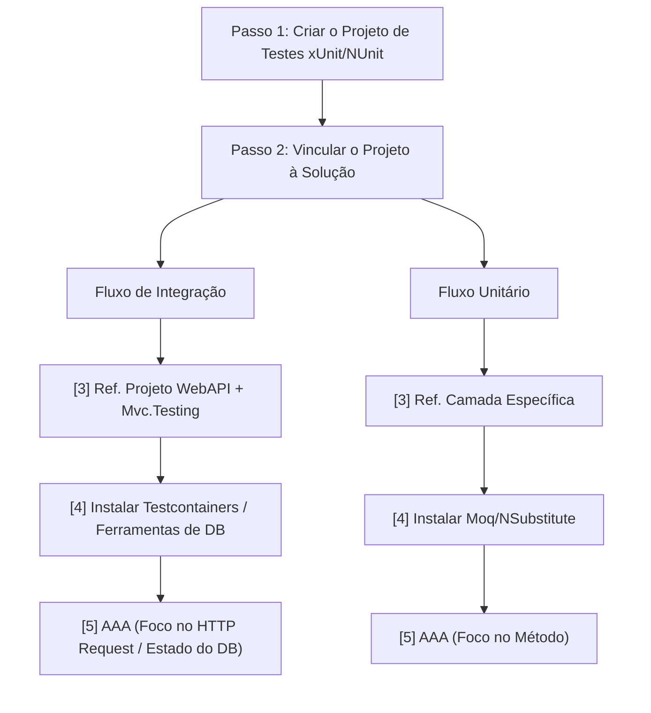

# Entendendo CI/CD: Integração e Entrega Contínua

**CI/CD** significa **Continuous Integration** (Integração Contínua) e **Continuous Delivery** ou **Continuous Deployment** (Entrega ou Implantação Contínua).

Na prática, é uma metodologia apoiada por automação que transforma o ciclo de desenvolvimento de software, garantindo que o código saia da máquina do desenvolvedor e chegue até o ambiente de produção de forma rápida, segura e padronizada.

Imagine o CI/CD como uma esteira de produção automatizada: o código entra em uma ponta, passa por testes, validações e empacotamento, e sai na outra ponta pronto para o usuário final, sem depender de processos manuais lentos e propensos a falhas humanas.

## Entendendo os Pilares

### 1. CI — Continuous Integration (Integração Contínua)

O foco do CI é a **frequência** e a **validação**. Em vez de os desenvolvedores trabalharem isolados por semanas e enfrentarem o famoso _"infretável"_ conflito de merge (o "merge hell") no final do mês, eles integram suas alterações no repositório central (como o GitHub ou GitLab) várias vezes ao dia.

Cada vez que um código é enviado, a esteira automatizada entra em ação:

-   **Build:** O sistema compila o código para garantir que não há erros de sintaxe ou dependências quebradas.
    
-   **Testes Automatizados:** São executados testes unitários e de integração para validar se a nova funcionalidade não quebrou nenhuma regra de negócio existente.
    

> **Regra de Ouro do CI:** Se um teste falhar, o build quebra e a equipe é avisada imediatamente. O código defeituoso não avança.

### 2. CD — Continuous Delivery vs. Continuous Deployment

Aqui o termo se divide em duas abordagens, dependendo do nível de automação que a empresa adota após o código passar pelo processo de CI.

-   **Continuous Delivery (Entrega Contínua):** O código passa por todas as etapas de testes e é empacotamento de forma automática, gerando um artefato pronto para ir para produção. No entanto, **a decisão final de colocar o código no ar é manual** (um clique de um botão pelo gerente de release ou equipe de operações).
    
-   **Continuous Deployment (Implantação Contínua):** É o próximo nível de automação. Não há intervenção humana. Se o código passou em todos os testes do CI e nas validações de staging (ambiente de homologação), ele é **implantado automaticamente em produção** diretamente para os clientes.
## Vantagens no Mundo Real

-   **Feedbacks Rápidos:** Se você cometer um erro de lógica, a esteira te avisa em minutos, e não semanas depois através de uma reclamação de bug do cliente.
    
-   **Releases Menores e Menos Arriscadas:** Publicar pequenas alterações diariamente é infinitamente mais seguro do que acumular 50 novas funcionalidades para atualizar o sistema de uma só vez.
    
-   **Automação de Tarefas Repetitivas:** O desenvolvedor foca em programar, enquanto a esteira cuida do trabalho burocrático de rodar testes, buildar, gerar imagens Docker e atualizar servidores.

## Como criar um projeto de testes?


`adicionar uma foto da estrutura de pastas do meu projeto`

## 1. Testes Unitários (Unit Tests)

O foco do teste unitário é testar a **menor unidade isolada de código** possível. Geralmente, essa unidade é um método ou uma função específica de uma classe.

A regra principal aqui é o **isolamento absoluto**: o teste unitário não pode conversar com o banco de dados, não pode fazer chamadas de rede (APIs externas) e não pode depender do sistema de arquivos. Qualquer dependência externa é substituída por um objeto simulado (chamado de **Mock** ou **Stub**).

-   **Analogia do carro:** É você tirar uma vela de ignição do motor, colocá-la em uma bancada de testes isolada e verificar se ela solta faísca quando recebe corrente elétrica. Você não quer saber se o motor liga; quer saber se _aquela peça específica_ funciona sozinha.
    
-   **No código (Exemplo prático):** Se você tem uma classe de cálculo de desconto, o teste unitário vai passar um valor $X$ e verificar se o retorno é exatamente o esperado, testando cenários como valores negativos, zero ou descontos acima do limite.
    

### Vantagens:

-   **Velocidade:** Como rodam totalmente em memória e sem comunicação externa, milhares de testes unitários são executados em pouquíssimos segundos.
    
-   **Precisão do erro:** Se o teste falhar, você sabe exatamente qual linha de código e qual regra de negócio quebrou.

### Como Implementar?
* Passo 1: Organizar as Pastas e Criar o Projeto de Testes
* Passo 2: Vincular o Projeto de Testes à Solução
* Passo 3: Referenciar a sua API / Código Principal
* Passo 4: Instalar as Ferramentas de Mock
* **Passo 5: Escrever o Primeiro Teste (Padrão AAA):** Crie uma classe de teste. Toda estrutura de teste unitário deve seguir o padrão **AAA (Arrange, Act, Assert)**:
-   **Arrange (Organizar):** Prepara o cenário, cria instâncias e simula os mocks.    
-   **Act (Agir):** Executa o método específico que você quer testar.    
-   **Assert (Verificar):** Garante que o resultado obtido é igual ao resultado esperado.
```csharp
//exemplo vitrine
```
* Passo 6: Executar os Testes

## 2. Testes de Integração (Integration Tests)

O foco do teste de integração é validar se **duas ou mais unidades/componentes funcionam bem juntos**. Ele preenche a lacuna que o teste unitário deixa ao isolar tudo.

Aqui, nós queremos testar os pontos de atrito: a comunicação entre o seu código e o banco de dados real, a integração com uma API de pagamento, ou se duas classes de regras de negócio distintas conversam corretamente sem corromper os dados.

-   **Analogia do carro:** É o momento de montar a vela no motor, conectar o tanque de combustível, girar a chave e ver se o motor dá a partida. As peças individuais podem estar perfeitas, mas se o cabo de combustível estiver entupido (falha na integração), o motor não vai funcionar.
    
-   **No código (Exemplo prático):** Um teste que faz uma requisição HTTP real para um endpoint da sua API, que por sua vez dispara um comando para salvar um registro em um banco de dados de testes (geralmente em memória ou local) e retorna o status `201 Created`.
    

### Vantagens:

-   **Confiança Real:** Ele garante que as partes do sistema realmente se conectam e que as queries do banco de dados estão corretas.
    
-   **Pega falhas ocultas:** Descobre erros de configuração, problemas de permissão de acesso a dados ou incompatibilidade de contratos entre sistemas.
### Como Implementar?
dafsdfsdfsdf

## Github actions
* Passo 1: Criar as pastas da esteira
* Passo 2: Criar o arquivo de configuração (YAML)
* Passo 3: Configurar o YAML
```csharp
codigo vitrine
```
* Passo 4: Enviar para o GitHub
* Passo 5: Ver a mágica acontecer
  1.  Abra o seu repositório no site do **GitHub**.
  2.  Clique na aba **"Actions"** (fica no menu superior, ao lado de Pull Requests).
  3.  Você verá o seu commit listado lá com uma bolinha amarela piscando (significa que a máquina da nuvem está rodando os seus testes).
  4.  Se tudo passar, a bolinha vira um **check verde** 🟢. Se algum teste falhar, vira um **X vermelho** 🔴, e você pode clicar nele para ver exatamente qual teste quebrou.
`adicionar imagem do github da vitrine`

```mermaid
graph TD
    Cod[Código] --> GP[Git Push]
    GP --> C1[1. Compilar o Código]

    subgraph CI [ESTEIRA DE CI]
        C1 --> C2[2. TESTES UNITÁRIOS]
        C2 --> C3[3. TESTES DE INTEGRAÇÃO]
        C3 --> C4[4. Análise de Código]
    end

    C4 -- Se tudo passar --> D1[1. Gerar Artefato/Docker]

    subgraph CD [ESTEIRA DE CD]
        D1 --> D2[2. Deploy em Homologação]
        D2 --> D3[3. Deploy em Produção]
    end

    %% Notas explicativas alinhadas
    N1[Rápido feedback de lógica] -.-> C2
    N2[Valida infra/banco/APIs] -.-> C3

    %% Estilização
    style N1 fill:none,stroke:none,text-align:left;
    style N2 fill:none,stroke:none,text-align:left;
```


